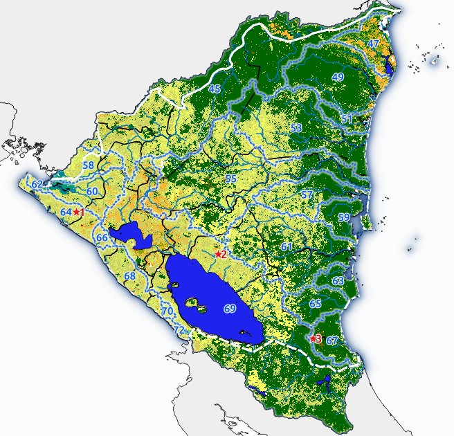
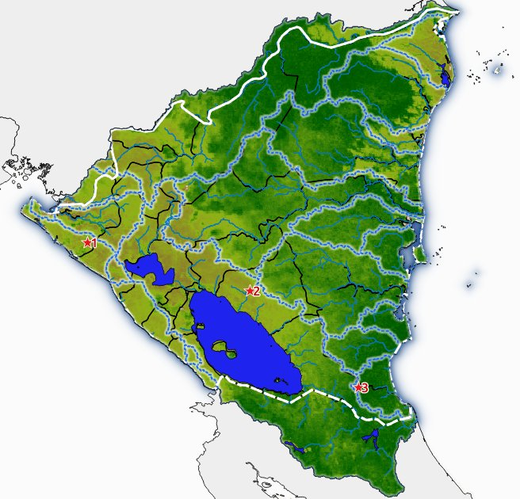

# Nica EcoComputación: Datos y computación ambiental de Nicaragua

Esta será la página introductoria al sitio. Abajo incluyo unos mapas generados 
anteriormente, para un proyecto.

:::{figure,myclass} fig1

Mapa de referencia de cobertura de suelo y cuenca hidrográficas (Globcover2009)
:::

:::{figure,myclass} fig2

Climatología mensual de abril, Índice Mejorado de Vegetación (Enhanced Vegetation Index, EVI)
:::
